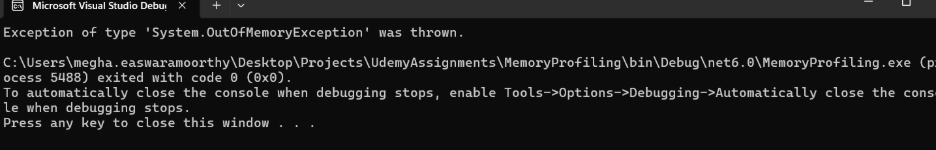
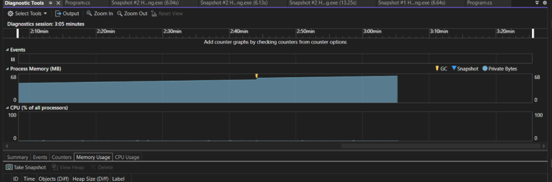
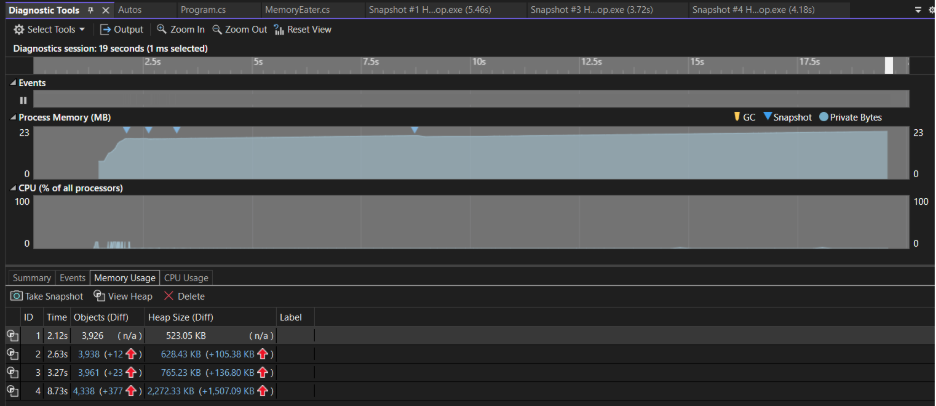

# Assignment-12 : Memory Optimization in C#
 
## Overview
 
Detect, diagnose, and resolve memory issues in a C# codebase.

---

## Task 1

- Identify and diagnose memory issues in a C# program.
- Issue identified: The code causes OutOfMemoryException.
- Allocates memory in an infinite loop.

- With the Infinite allocation of memory in the code snippet given in Task1, the memory usage went beyond 68 MB, until OutOfMemoryException was thrown

## Task 2

- Fix the memory issue in the provided code snippet and implement memory management best practices.

            while (true)
            {
                if (this._memAlloc.Count > maxValue)
                {
                    return;
                }

                this._memAlloc.Add(new int[1000]);
                Thread.Sleep(10);
            }

- The above code takes maxValue as threshold limit, when the list count exceeds the limit, the method is exited.
- When the method is exited, automatically the List instance becomes dead as they become unreachable in the program.
- This provides efficient memory usage, as now the unused List instance are eligible for cleanup by the GC.
- When threshold was set to 1000, the memory usage went up to 23MB. 

- Before cleanup(), the array instances will not be cleared and will be present in the managed heap. 
- After cleanup() is executed, the memory occupied by array instances will be cleared and all the array instances will become Dead Objects. 

## Task 3

- Understand and demonstrate the use of the memory profiling tool in VS for C#.

## Task 4

- Understand Memory management.

## Memory Profiling Observations and Understandings

- Link: https://solitontech-my.sharepoint.com/:w:/p/megha_easwaramoorthy/IQChMrYuViqnQYf2rUxkz0c0AfP6PcoZZ8UIa-w1zKUPupg?e=gUuOWT
