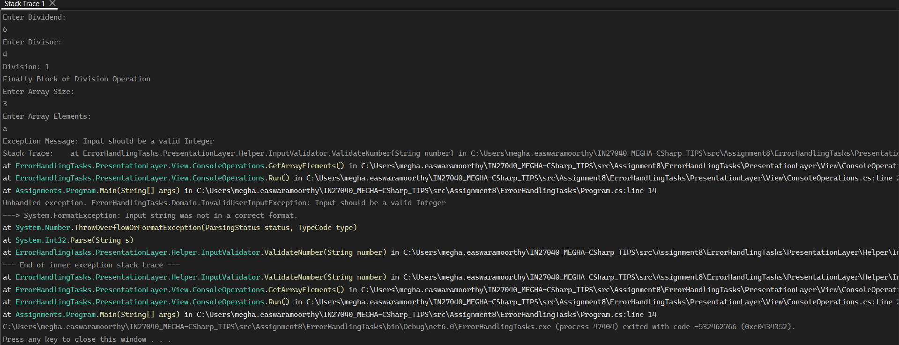

## Interpretation of Stack Trace

- A stack trace is a reverse ordered list of method calls that shows the exact path execution took up to a specific moment or error.

 Example: 

- Read Stack Trace from Bottom to Top.
1. Program.Main (Line 14): Starts the application execution and calls the ConsoleOperations Run().
2. ConsoleOperations.Run (Line 20): Calls the GetArrayElements() module. (Here we don't have CalculateDivisionMethod() because it already successfully completed its execution before the error occurred)
3. ConsoleOperations.GetArrayElements (Line 62): Requests array values from uses and passes them for validation.

4. InputValidator.ValidateNumber (Line 16): Re-throws custom InvalidUserInputException after catching exception when parsing an invalid user-input.
5. InputValidator.ValidateNumber (Line 12): Runs the internal string-to-integer conversion that natively crashes on letters.

-  (5)  Line 12 happened FIRST, inside a try block
-  (4)  Line 16 happened SECOND, inside a catch block - throws custom InvalidUserInputException
-  When .NET prints a crash log, it lists the Outer Exception first (the final error that killed the app from Line 16), and then it prints a nested section starting with ---> to show the Inner Exception (the original root cause from Line 12)
- So only Line 16 is printed in Stack Trace first and then is Line 12

6. Int32.Parse - Line-12 called Int32.Parse, so it appears at the top of Line-12

7. System.Number.ThrowOverflowOrFormatException - Finds it that a letter is typed instead of integer and starts crash which will be handled by AppDomain.
(It is from core .NET runtime library)